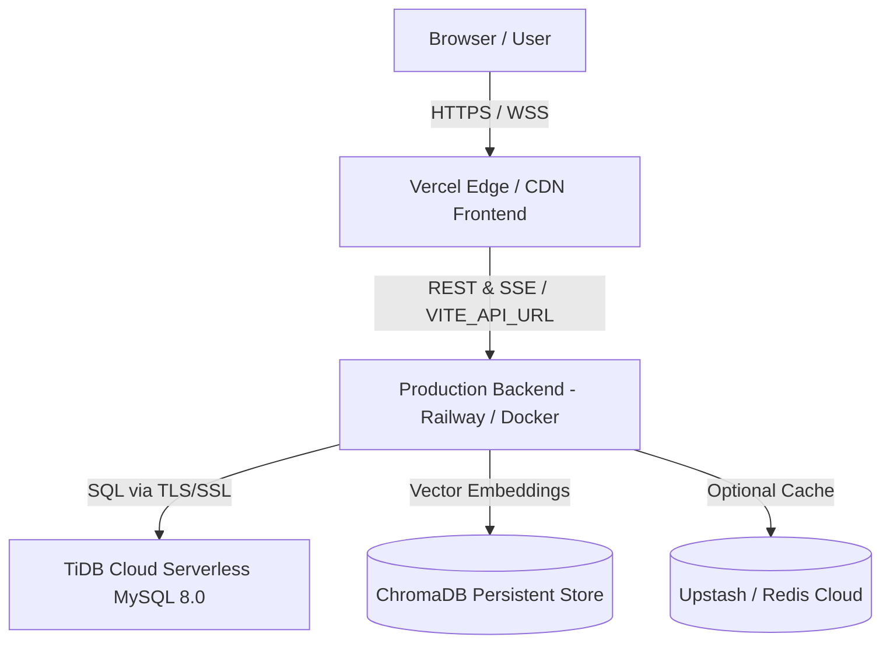

# PlainSQL Cloud Database Migration & Deployment Plan

## 1. Current Local Architecture
- **Web Frontend**: React 18 SPA built with Vite, utilizing client-side routing, SSE streaming subscriber, and modular UI components (`frontend/src/`). Runs locally on `http://localhost:5173`.
- **API Backend**: FastAPI application running with Uvicorn on `http://127.0.0.1:8000`. Exposes REST and SSE endpoints (`/chat/stream`, `/api/v1/auth`, `/api/v1/schema`, `/health`, `/ready`, `/metrics`).
- **Database Layer**: Single unified connection abstraction:
  - `DatabasePool` (`backend/app/db/connection.py`): SQLAlchemy QueuePool + PyMySQL engine. Connects locally or remotely to MySQL/TiDB.
  - `SQLitePool` (`backend/app/db/sqlite_pool.py`): SQLite3 connection pool for Spider benchmark evaluation.
  - `DatabaseRegistry` (`backend/app/db/registry.py`): Dispatches requests by `db_id`. Registers `default` as the production SaaS database and discovers Spider evaluation databases lazily.
- **RAG & Semantics**:
  - `HybridRetriever` (`backend/app/rag/retriever.py`): ChromaDB vector search (`schema_knowledge_v2`) + BM25Okapi keyword search combined via Reciprocal Rank Fusion (RRF).
  - Business Knowledge: `backend/app/semantics/business_glossary.yaml` loaded and validated via `BusinessKnowledgeLoader`.
  - Persistent Learning: Phase 11 feedback and clarification loop stored in `learning_events.jsonl`.
- **Caching & Resilience**:
  - Multi-tier cache: Redis cache when configured, falling back to in-memory `QueryCache`.
  - Rate limiting: Redis sliding window with in-memory fallback.
  - Deduplication: In-flight request deduplication via `RequestDeduplicator`.

---

## 2. Current Production Architecture

- **Frontend Hosting**: Vercel (`frontend/vercel.json`), deploying the compiled Vite single-page application.
- **Backend Hosting**: Containerized FastAPI service hosted on Railway / Docker (`railway.toml`, `docker/Dockerfile.prod`, `Procfile`), executing `uvicorn app.main:app`.
- **Database Infrastructure**: TiDB Cloud Serverless instance (MySQL 8.0 wire-compatible) hosted on Alibaba Cloud (`gateway01.ap-southeast-1.prod.alicloud.tidbcloud.com`).
- **Security & Networking**:
  - TLS/SSL enforced for all TiDB connections via Python `ssl.create_default_context()`.
  - CORS strictly configured to allow Vercel origins (`allow_origin_regex=r"https://.*\.vercel\.app"` and custom origins).
  - Credentials securely injected via environment variables; never exposed to browser client.

---

## 3. Existing TiDB Configuration
- **Host**: `gateway01.ap-southeast-1.prod.alicloud.tidbcloud.com`
- **Port**: `4000` (MySQL default/TiDB gateway)
- **Database Name**: `chatbot`
- **Dialect**: MySQL 8.0 wire-compatible (Serverless TiDB)
- **Connection Engine**: SQLAlchemy `QueuePool` with `pool_size=10`, `max_overflow=20`, `pool_recycle=1800` (preventing idle wait timeouts), `pool_pre_ping=True` (resilient connection testing), and statement execution timeouts (`SET SESSION max_execution_time`).
- **SSL Context**: Enabled (`ssl=create_default_context()`).
- **Read-Only / Guardrails Enforcement**:
  - AST SQL parsing (`sqlglot`) blocks all DDL (`DROP`, `ALTER`, `TRUNCATE`, `CREATE`), DML (`INSERT`, `UPDATE`, `DELETE`), administrative commands (`GRANT`, `REVOKE`, `SET`), and multi-statement executions.
  - Read-only execution enforced at application level via `execute_query()`.
  - Maximum query timeout set to 30 seconds.

---

## 4. New Database / Data Source Categorization
A comprehensive audit of the repository reveals the following database assets:

| Asset / Source | Location | Dialect | Classification | Action / Destination |
|---|---|---|---|---|
| **B2B SaaS Production Schema** | `db.sql` | MySQL | **REQUIRED FOR PRODUCTION** | Canonical definition of the 18 SaaS domain tables in TiDB Cloud. |
| **Persistence & Auth Tables** | `persistence.py`, `user_repository.py`, `startup.py` | MySQL | **REQUIRED FOR PRODUCTION** | Defines 4 operational tables (`conversations`, `messages`, `plainsql_users`, `query_feedback`) in TiDB Cloud. |
| **Enriched Schema Metadata** | `chroma_db/enriched_schema.json` | JSON / Metadata | **REQUIRED FOR PRODUCTION** | 22 enriched table representations for Hybrid RAG indexing. |
| **Spider 2.0-Lite Benchmarks** | `E:\Downloads\local_sqlite/*.sqlite` (30 databases) | SQLite | **EVALUATION ONLY** | Kept in local SQLite directory; auto-discovered by `DatabaseRegistry` for benchmark evaluation only. **NOT** migrated to TiDB. |
| **Evaluation Datasets** | `backend/evaluation/datasets/*.json` | JSON | **EVALUATION ONLY** | Spider gold query benchmarks and fine-tuning datasets. |

---

## 5. Tables Detected in Production TiDB Database

The production TiDB database `chatbot` contains **22 verified tables** with **31,061 rows**:

### A. Core SaaS Domain Tables (18 tables from `db.sql`)
1. `departments`: 10 rows (Department budget, cost centers, regions)
2. `employees`: 80 rows (Staff, managers, roles, compensation, quota)
3. `plans`: 4 rows (Subscription tier catalog, pricing, seat limits)
4. `products`: 4 rows (Product family and lifecycle status)
5. `feature_catalog`: 10 rows (Feature mapping and risk classifications)
6. `accounts`: 120 rows (B2B customer organizations, ARR bands, health scores)
7. `contacts`: 360 rows (Account stakeholders and executives)
8. `workspaces`: 180 rows (Customer tenant workspaces)
9. `workspace_users`: 1,800 rows (End users provisioned across workspaces)
10. `opportunities`: 850 rows (Sales pipeline deals, stage, probabilities)
11. `subscriptions`: 360 rows (Contracted ARR, dates, billing status)
12. `invoices`: 4,320 rows (Billing records, tax, subtotals, invoice dates)
13. `payments`: 4,100 rows (Transaction records, payment methods, success status)
14. `query_audit_log`: 2,500 rows (Historical query executions and durations)
15. `product_usage_daily`: 12,000 rows (Daily active usage and compute metrics)
16. `support_tickets`: 1,600 rows (Customer service cases and priorities)
17. `ticket_events`: 3,200 rows (Ticket lifecycle event timeline)
18. `incidents`: 90 rows (Service reliability and outage records)

### B. PlainSQL Application & Operational Tables (4 tables)
19. `conversations`: 69 rows (Chat session metadata and timestamps)
20. `messages`: 0 rows (Historical message transcripts and executed SQL)
21. `plainsql_users`: 2 rows (Persistent authentication users: admin and analyst)
22. `query_feedback`: 2 rows (RLHF thumbs-up/down ratings on generated SQL)

**Total Row Count**: 31,061 rows.

---

## 6. Required Migration & Verification Steps
Because the production TiDB Cloud instance already holds the populated, live schema and data, the migration protocol enforces verification, reproducibility, and protection:

1. **Safety Verification**:
   - Verify connection and live table integrity.
   - Enforce read-only inspection; prohibit any automated `DROP TABLE`, `TRUNCATE`, or destructive DDL.
2. **Schema Export & Serialization**:
   - Provide `scripts/db/export_schema.py` to introspect live TiDB DDL and column specifications into a reproducible schema artifact.
3. **Automated Verification**:
   - Provide `scripts/db/verify_migration.py` to validate:
     - Table existence and row counts across all 22 tables.
     - Critical financial aggregates (`invoices.total`, `payments.amount`, `subscriptions.contracted_arr`).
     - Foreign key referential integrity across related parent-child tables.
4. **Business Knowledge Synchronization**:
   - Update `business_glossary.yaml` to include canonical metric definitions for `default` (TiDB Cloud) for `revenue`, `arr`, `nrr`, `churn`, and `active_customers`.
5. **Cache Isolation Enforcement**:
   - Ensure cache key construction in `RedisCache` and `QueryCache` explicitly incorporates `db_id` alongside `tenant_id` to guarantee zero cross-database cache bleed.
6. **Schema RAG & BM25 Audit**:
   - Re-index and confirm that all 22 TiDB tables are embedded in ChromaDB (`schema_knowledge_v2`) and BM25Okapi indices.
7. **Readiness & Health Verification**:
   - Validate `/health`, `/ready`, and `/metrics` endpoints report healthy status with TiDB connectivity.

---

## 7. Required Environment Variables

### Production Backend Environment (Railway / Cloud Host)
```env
# Application
APP_NAME=PlainSQL
APP_VERSION=2.0.0
ENV=production
LOG_LEVEL=INFO

# Database (TiDB Cloud Serverless)
DB_URI=mysql+pymysql://<user>:<password>@gateway01.ap-southeast-1.prod.alicloud.tidbcloud.com:4000/chatbot
DB_POOL_SIZE=10
DB_MAX_OVERFLOW=20
DB_QUERY_TIMEOUT=30

# Authentication & Security
JWT_SECRET_KEY=<strong_random_secret_32_bytes_min>
JWT_ALGORITHM=HS256
JWT_EXPIRY_HOURS=24
ADMIN_DEFAULT_PASSWORD=<strong_production_admin_password>
ANALYST_DEFAULT_PASSWORD=<strong_production_analyst_password>
CORS_ORIGINS=["https://plainsql.vercel.app","https://plainsql-ai.vercel.app"]

# LLM Providers
DEFAULT_LLM_PROVIDER=groq
GROQ_API_KEY=<gsk_api_key>
GROQ_MODEL_PRIMARY=llama-3.3-70b-versatile
GROQ_MODEL_FAST=llama-3.1-8b-instant

# Vector Store / RAG
CHROMA_PERSIST_DIR=./chroma_db
DISABLE_VECTOR_RAG=false

# Optional Redis Cache
REDIS_URL=redis://default:<password>@<redis_host>:6379
RATE_LIMIT_RPM=60
CACHE_TTL_SECONDS=300
```

### Production Frontend Environment (Vercel)
```env
# Vercel Production Environment Variable
VITE_API_URL=https://plainsql-backend.up.railway.app
```
*(No database credentials, secrets, or API keys are ever provided to Vercel).*

---

## 8. Risks and Mitigations

| Risk | Impact | Mitigation |
|---|---|---|
| **Accidental Data Loss** | High | Scripts use strictly parameterized `SELECT` queries. DDL/DROP statements are disabled and barred from automated scripts. |
| **Connection Stalling / Timeouts** | Medium | SQLAlchemy `pool_pre_ping=True`, `pool_recycle=1800`, socket timeout, and TiDB `max_execution_time` statements enforce strict deadlines. |
| **Cross-Database Cache Contamination** | High | Cache key structure upgraded to incorporate `tenant_id:db_id:hash(query)`. |
| **Stale Schema in RAG Index** | High | `HybridRetriever` introspects and enriches schema on startup; verified against live 22 tables. |
| **Secrets Exposure** | Critical | `.env` strictly git-ignored. `.env.example` scrubbed of secrets. Frontend bundle verified to contain zero server secrets. |

---

## 9. Rollback Strategy
1. **Database Rollback**:
   - The TiDB Cloud database schema and data remain untouched by migrations (zero destructive actions).
   - If an application defect is detected, rollback is performed exclusively via backend container deployment (redeploying previous Git commit tag).
   - TiDB Cloud Serverless supports Point-in-Time Recovery (PITR) with automatic daily snapshots and continuous WAL logs.
2. **Backend Rollback**:
   - Railway / Docker supports single-click rollback to the prior release container image.
3. **Frontend Rollback**:
   - Vercel supports instant deployment rollback to the prior production deployment alias within seconds.
