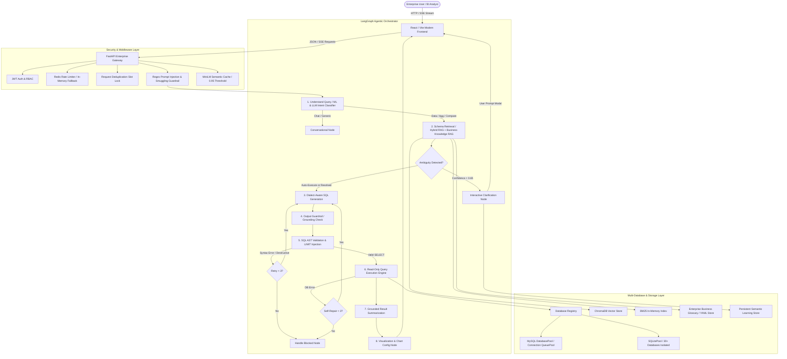
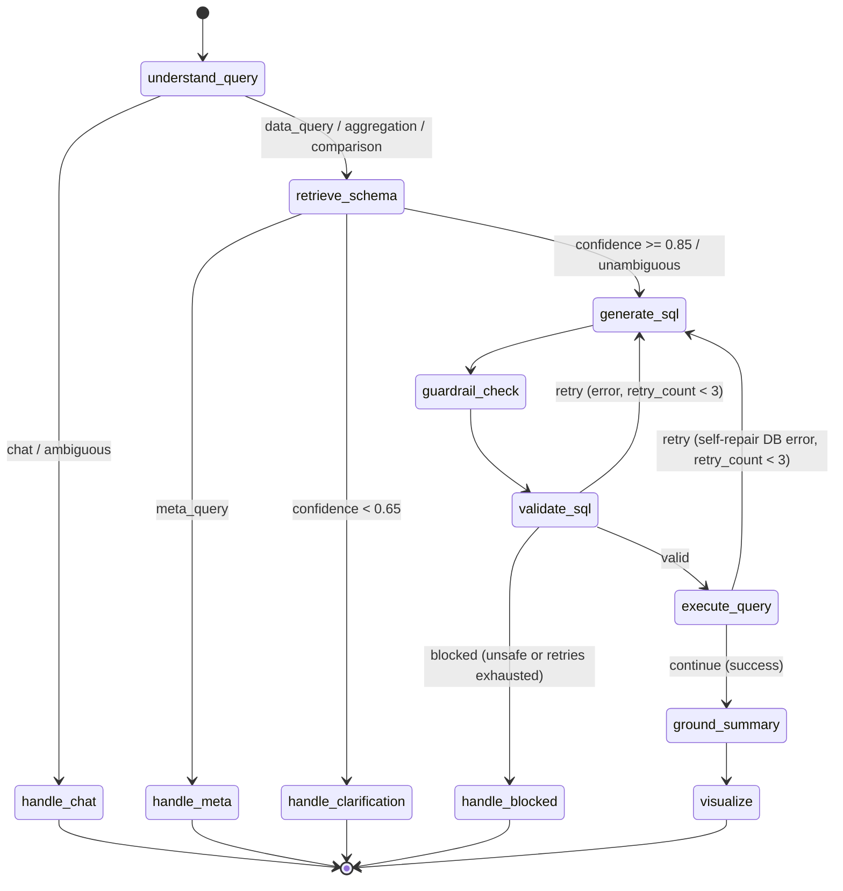
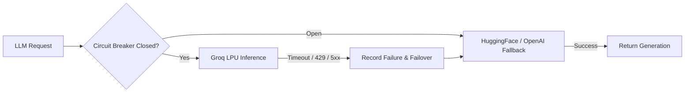

# DataPilot — Complete System Architecture Specification

## Executive Summary
**DataPilot** is a production-oriented enterprise AI Data Analyst that enables users to query multi-database environments in natural language, generating safe, dialect-aware, factually grounded SQL, analytics, and interactive visualizations. Text-to-SQL serves as its core query engine, backed by schema-aware hybrid RAG, business knowledge, and AST guardrails.

---

## 1. High-Level Architecture Diagram



---

## 2. Request Lifecycle

1. **Ingress & Correlation**:
   Every incoming HTTP request receives an `X-Request-ID` and is bound to a structured log context via `structlog`.
2. **Deduplication & Fast-Path**:
   Concurrent duplicate requests are coalesced using `RequestDeduplicator`. Conversational questions ("hello", "thanks") are routed via regex fast-path in under 1ms.
3. **Semantic Caching**:
   High-confidence queries with cosine similarity $\ge 0.95$ against previously answered questions return cached results directly without invoking downstream LLMs.
4. **Input Sanitization**:
   `InputValidator` inspects character encodings, query length, instruction-override injections, delimiter hijacking, and SQL smuggling patterns.
5. **Intent Understanding**:
   `query_understanding_node` categorizes intent into `chat`, `data_query`, `aggregation`, `comparison`, or `meta_query`.
6. **Schema Retrieval (Hybrid RAG + Business Knowledge RAG)**:
   - Dense retrieval: ChromaDB embedding search using `all-MiniLM-L6-v2`.
   - Sparse retrieval: BM25 keyword matching across column comments, descriptions, and table names.
   - Reciprocal Rank Fusion (RRF): Combines ranks with exact table mention boosting.
   - Business Knowledge Retrieval: Hybrid search over `business_glossary.yaml` for domain definitions (e.g., GMV, NRR, churn).
7. **Semantic Disambiguation & Clarification Loop**:
   - `AmbiguityDetector` checks candidate columns.
   - If confidence $\ge 0.85$, auto-executes using best candidate.
   - If confidence $< 0.65$ with multiple plausible candidates, suspends execution and yields an interactive clarification payload to the user.
8. **Dialect-Aware SQL Generation**:
   Generates SQL tailored specifically to the target database dialect (SQLite vs MySQL) with dialect-specific functions (`strftime`/`julianday` vs `DATE_FORMAT`/`TIMESTAMPDIFF`).
9. **AST-Based Validation Guardrails**:
   `sqlparse` AST parsing verifies:
   - Statement begins with `SELECT` or `WITH`.
   - Single-statement query enforcement (blocks stacked queries and multiple semicolons).
   - Zero destructive tokens (`DROP`, `DELETE`, `UPDATE`, `INSERT`, `ALTER`, `TRUNCATE`, `ATTACH`, `DETACH`).
   - Injection of mandatory `LIMIT` (default 1000).
10. **Read-Only Execution & Self-Repair**:
    Queries execute with query timeouts and connection safety. If a SQL execution exception occurs, the error message feeds back into `generate_sql` for up to 3 self-repair attempts.
11. **Grounded Fact Summarization**:
    Post-execution, `result_summary_node` analyzes real numeric columns to construct factually grounded summaries, eliminating hallucinated statistics.
12. **Streaming Delivery**:
    SSE pipeline streams stage progress events (`stage`, `intent`, `sql`, `results`, `done`) in real time to the web frontend.

---

## 3. LangGraph Orchestration & State Machine

The orchestration graph uses LangGraph's `StateGraph(AgentState)`:



### State Fields (`AgentState`):
- `user_query`: Sanitized natural-language input.
- `db_id`: Database identifier (e.g., `'chinook'`, `'E_commerce'`, `'default'`).
- `sql_dialect`: Database SQL dialect (`'sqlite'` | `'mysql'`).
- `schema_context`: Retrieved tables, columns, foreign keys, and business knowledge context.
- `generated_sql`: Raw SQL proposed by the LLM.
- `sanitized_sql`: Safe, validated SQL ready for execution.
- `query_results`: Rows returned from execution.
- `clarification_state`: Metadata for interactive ambiguity pauses.
- `retry_count`: Integer tracking generation retries and self-repairs.

---

## 4. Hybrid Schema RAG & Business Knowledge Retrieval

### Hybrid Schema RAG
- **ChromaDB Vector Store**: Persisted vector embeddings generated via `sentence-transformers/all-MiniLM-L6-v2`.
- **BM25 In-Memory Index**: Inverted index scoring keywords, column names, table comments, and primary/foreign keys.
- **Reciprocal Rank Fusion (RRF)**:
  $$\text{RRF\_Score}(d) = \sum_{m \in \{\text{dense}, \text{sparse}\}} \frac{1}{60 + \text{rank}_m(d)}$$
- **Exact Table Boosting**: Mentions of exact table names in user text receive priority boosting.
- **Cross-Encoder Reranking**: Re-scores top-k candidates using cross-encoder attention when enabled.

### Business Knowledge RAG
- Centralized `business_glossary.yaml` external enterprise glossary.
- Strict database isolation (`database_id` filtering prevents cross-tenant leakage).
- Priority Hierarchy:
  1. Enterprise Glossary Definition (`priority: 100`)
  2. Promoted User-Confirmed Definition (`priority: 50`)
  3. General Schema Reasoning (`fallback`)

---

## 5. Security & Safety Architecture

```
User Input 
   │
   ▼
[Layer 1: Input Validator]
   - Max length: 1,000 characters
   - Regex prompt injection filters
   - Control character strip
   - SQL smuggling rejection
   │
   ▼
[Layer 2: LLM Output Guardrail]
   - Grounding check: rejects non-existent tables/columns
   - Confidence extraction
   │
   ▼
[Layer 3: SQL AST Validator]
   - sqlparse AST token inspection
   - Allowed type: SELECT, WITH
   - Blocked: DROP, DELETE, UPDATE, INSERT, ALTER, TRUNCATE, ATTACH, DETACH
   - Multi-statement detection (multiple semicolons prohibited)
   - Dangerous pattern regex (SLEEP, BENCHMARK, LOAD_FILE, INTO OUTFILE)
   - Mandatory LIMIT injection (default 1000)
   │
   ▼
[Layer 4: Database Execution Pool]
   - Read-only transaction enforcement
   - Query timeout enforcement (30s)
   - Isolated thread pools / connection reuse
```

---

## 6. LLM Routing & Provider Resilience



- **Circuit Breaker**: Trips after 3 consecutive failures; initiates a 60s cooldown before entering `half_open` probe state.
- **Deterministic Evaluation Mode**: Under `PLAINSQL_EVAL_MODE=true`, provider pinning is enforced, temperature is locked to `0.0`, seed is pinned (`42`), and silent provider failover is disabled to guarantee benchmark reproducibility.

---

## 7. Performance & Observability Architecture

- **Structured Logging**: Unified JSON logging via `structlog` with request correlation IDs.
- **Metrics**: Prometheus exposition format served at `GET /metrics` and `/api/v1/metrics/prometheus`.
- **Health Probes**:
  - `GET /health`: Liveness probe.
  - `GET /ready`: Readiness probe verifying DatabasePool, ChromaDB collection count, and LLM providers.
